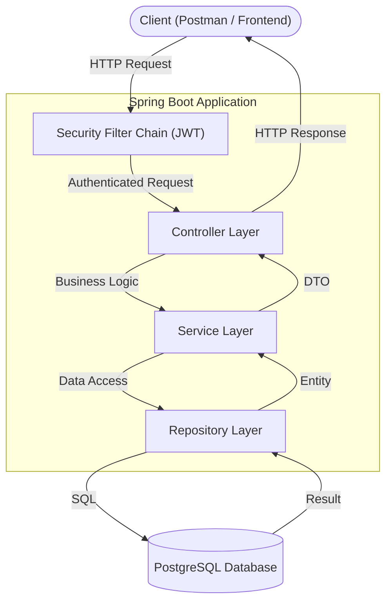
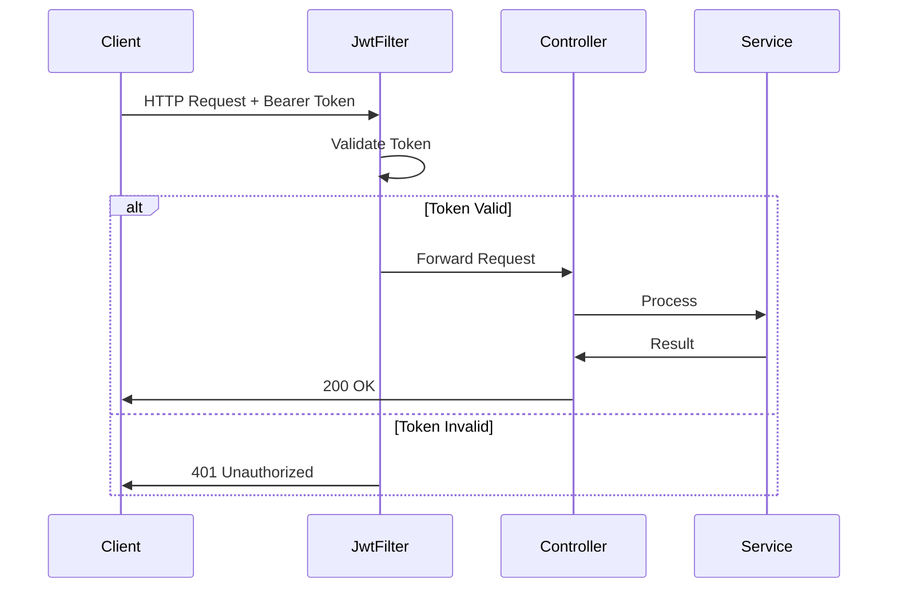

# Application Architecture

## Layer Architecture



## Layer Responsibilities

| Layer | Class | Responsibility |
|---|---|---|
| Controller | `*Controller.java` | Receives HTTP requests, returns HTTP responses |
| Service | `*Service.java` | Contains business logic and authorization rules |
| Repository | `*Repository.java` | Database operations via JPA |
| Entity | `*.java` | Database table mapping |
| DTO | `*Request.java` / `*Response.java` | Data transfer between layers |

## Security Flow



## Package Structure

```
src/main/java/com/example/taskmanagement/
├── controller/
│   ├── AuthController.java
│   ├── ProjectController.java
│   └── TaskController.java
├── service/
│   ├── AuthService.java
│   ├── ProjectService.java
│   └── TaskService.java
├── repository/
│   ├── UserRepository.java
│   ├── ProjectRepository.java
│   ├── ProjectMemberRepository.java
│   └── TaskRepository.java
├── entity/
│   ├── User.java
│   ├── Project.java
│   ├── ProjectMember.java
│   └── Task.java
├── dto/
│   ├── request/
│   │   ├── RegisterRequest.java
│   │   ├── LoginRequest.java
│   │   ├── CreateProjectRequest.java
│   │   └── CreateTaskRequest.java
│   └── response/
│       ├── AuthResponse.java
│       ├── ProjectResponse.java
│       └── TaskResponse.java
├── enums/
│   ├── Role.java
│   ├── ProjectStatus.java
│   ├── MemberRole.java
│   ├── TaskStatus.java
│   └── TaskPriority.java
├── exception/
│   ├── GlobalExceptionHandler.java
│   ├── ResourceNotFoundException.java
│   └── ForbiddenException.java
└── security/
    ├── JwtService.java
    ├── JwtAuthFilter.java
    └── SecurityConfig.java
```
