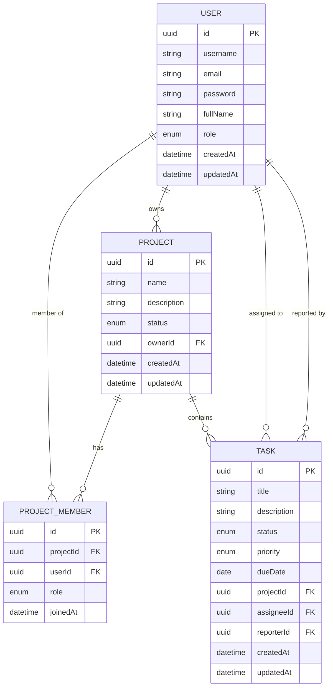

# Entity Relationship Diagram

```mermaid
erDiagram
    USER {
        uuid id PK
        string username
        string email
        string password
        string fullName
        enum role
        datetime createdAt
        datetime updatedAt
    }

    PROJECT {
        uuid id PK
        string name
        string description
        enum status
        uuid ownerId FK
        datetime createdAt
        datetime updatedAt
    }

    PROJECT_MEMBER {
        uuid id PK
        uuid projectId FK
        uuid userId FK
        enum role
        datetime joinedAt
    }

    TASK {
        uuid id PK
        string title
        string description
        enum status
        enum priority
        date dueDate
        uuid projectId FK
        uuid assigneeId FK
        uuid reporterId FK
        datetime createdAt
        datetime updatedAt
    }

    USER ||--o{ PROJECT : "owns"
    USER ||--o{ PROJECT_MEMBER : "member of"
    PROJECT ||--o{ PROJECT_MEMBER : "has"
    PROJECT ||--o{ TASK : "contains"
    USER ||--o{ TASK : "assigned to"
    USER ||--o{ TASK : "reported by"
```
