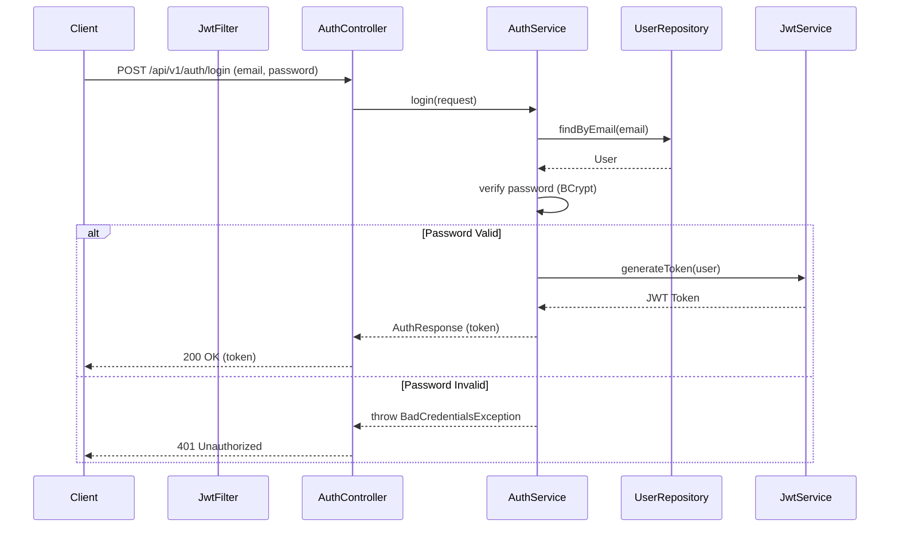
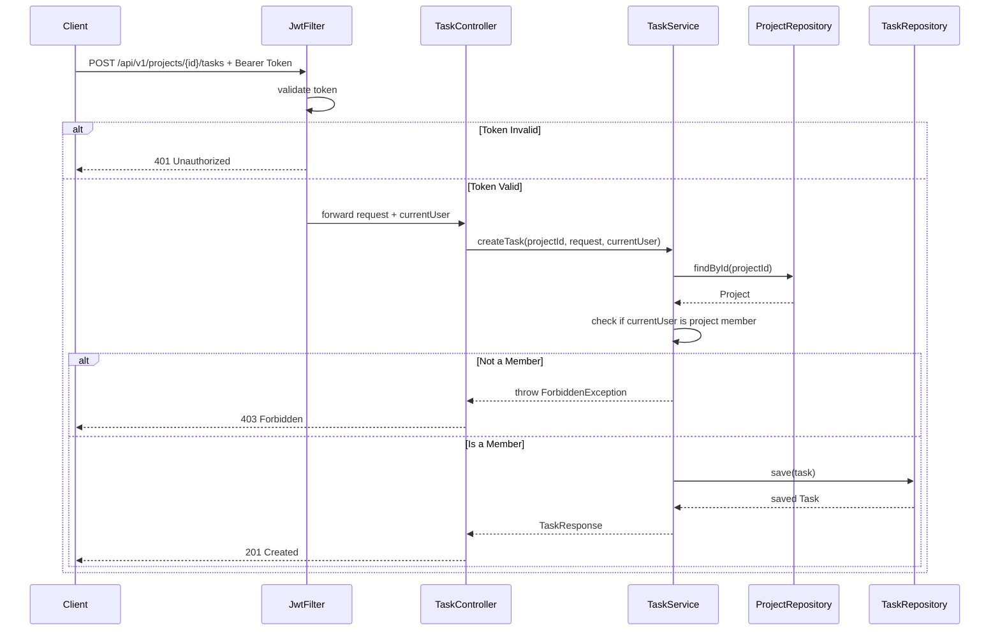

# Sequence Diagrams

## 1. Login Flow

```mermaid
sequenceDiagram
    participant Client
    participant JwtFilter
    participant AuthController
    participant AuthService
    participant UserRepository
    participant JwtService

    Client->>AuthController: POST /api/v1/auth/login (email, password)
    AuthController->>AuthService: login(request)
    AuthService->>UserRepository: findByEmail(email)
    UserRepository-->>AuthService: User
    AuthService->>AuthService: verify password (BCrypt)
    alt Password Valid
        AuthService->>JwtService: generateToken(user)
        JwtService-->>AuthService: JWT Token
        AuthService-->>AuthController: AuthResponse (token)
        AuthController-->>Client: 200 OK (token)
    else Password Invalid
        AuthService-->>AuthController: throw BadCredentialsException
        AuthController-->>Client: 401 Unauthorized
    end
```

## 2. Task Creation Flow

```mermaid
sequenceDiagram
    participant Client
    participant JwtFilter
    participant TaskController
    participant TaskService
    participant ProjectRepository
    participant TaskRepository

    Client->>JwtFilter: POST /api/v1/projects/{id}/tasks + Bearer Token
    JwtFilter->>JwtFilter: validate token
    alt Token Invalid
        JwtFilter-->>Client: 401 Unauthorized
    else Token Valid
        JwtFilter->>TaskController: forward request + currentUser
        TaskController->>TaskService: createTask(projectId, request, currentUser)
        TaskService->>ProjectRepository: findById(projectId)
        ProjectRepository-->>TaskService: Project
        TaskService->>TaskService: check if currentUser is project member
        alt Not a Member
            TaskService-->>TaskController: throw ForbiddenException
            TaskController-->>Client: 403 Forbidden
        else Is a Member
            TaskService->>TaskRepository: save(task)
            TaskRepository-->>TaskService: saved Task
            TaskService-->>TaskController: TaskResponse
            TaskController-->>Client: 201 Created
        end
    end
```
